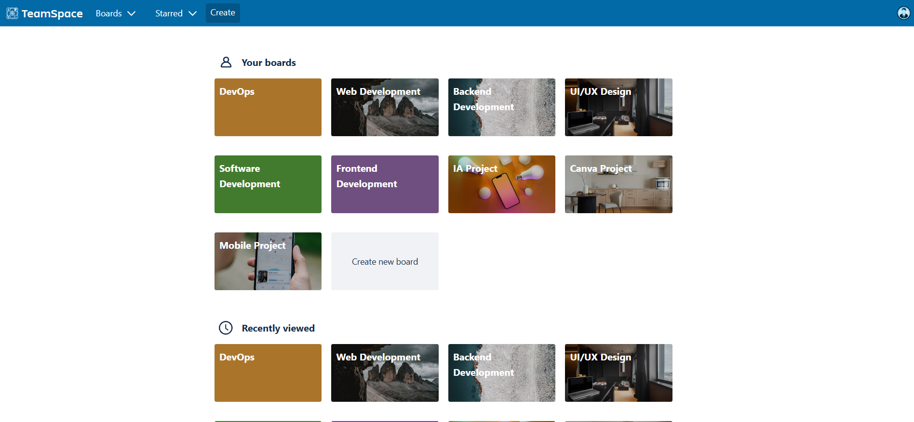

# TeamSpace

Task and collaboration management application inspired by Trello, designed to streamline workflows and improve team communication.

## Key Features

*   **Project Management**: Create and organize boards, lists, and cards for efficient project management.
*   **Customizable Workspaces**: Adapt your workspaces to different types of projects (software development, UI/UX, etc.).
*   **In-depth Task Details**: Manage tasks with due dates, members, labels, and attachments.
*   **Real-time Collaboration**: Track activities and updates live.
*   **Intuitive Interface**: Simple navigation and a clean design for an optimal user experience.

## Technologies Used

This project is built with the following technologies:

*   **Backend**: Node.js, Express.js
*   **Frontend**: React.js
*   **Database**: MongoDB

## Quick Start

To run the project locally, follow these steps:

1.  **Clone the repository**:

    ```bash
    git clone https://github.com/hamzakh86/codealpha-teamspace.git
    cd codealpha-teamspace
    ```

2.  **Install Backend dependencies**:

    ```bash
    cd Backend
    npm install
    npm start
    ```

3.  **Install Frontend dependencies**:

    ```bash
    cd Frontend
    npm install
    npm start
    ```

## Visual Overview

### Home Page


### Login / Registration


### Your Boards



### Project Board


### Task Details


### Side Menu


